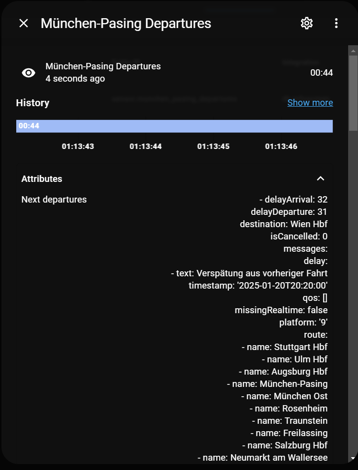

<div align="center">
  
  <h1>DB Infoscreen Home Assistant Sensor 🚆</h1>
  <p><strong>A comprehensive departure board integration for Home Assistant.</strong></p>

  [](https://github.com/hacs/integration)
  [](https://github.com/FaserF/ha-db_infoscreen/releases)
  [](LICENSE)
</div>

---

The `db-infoscreen` sensor provides detailed **departure times** and train information for a given station directly in Home Assistant. Aggregating data from multiple sources (primarily **Deutsche Bahn IRIS-TTS**), it offers a powerful and comprehensive departure board for stations across Germany and Europe.

<div align="center">
  
</div>

## ✨ Features

| Feature | Description |
| :--- | :--- |
| 📋 **Departure Board** | View next departures, delays, platforms, and train types. |
| 🌍 **Wide Coverage** | Supports DB and many local transport associations (via HAFAS/EFA). |
| ⚙️ **Highly Configurable** | Filter by direction, train type, specific platforms, and more. |
| ℹ️ **Detailed Attributes** | Access route info, warnings, messages, and train composition details. |

---

## 🛠️ Installation

### 1. Using HACS (Recommended)

This integration is available as a default repository in HACS.

1.  Open **HACS**.
2.  Search for `db-infoscreen`.
3.  Click **Download**.
4.  Restart Home Assistant.

[](https://my.home-assistant.io/redirect/hacs_repository/?owner=FaserF&repository=ha-db_infoscreen&category=integration)

> [!TIP]
> HACS ensures you stay up-to-date with the latest API changes and bug fixes.

### 2. Manual Installation

1.  Download the latest [Release](https://github.com/FaserF/ha-db_infoscreen/releases/latest).
2.  Extract the ZIP file.
3.  Copy the `db_infoscreen` folder into your `<config>/custom_components/` directory.
4.  Restart Home Assistant.

---

## ⚙️ Configuration

1.  Go to **Settings** -> **Devices & Services**.
2.  Click **Add Integration**.
3.  Search for **DB Infoscreen**.

[](https://my.home-assistant.io/redirect/config_flow_start/?domain=db_infoscreen)

### Configuration Options

| Option | Type | Required | Default | Description |
| :--- | :--- | :--- | :--- | :--- |
| `station` | string | **Yes** | - | Station name, Trip number, or DS100 ID (e.g. `München Hbf` or `MH`). Check [DS100 List](https://ds100.frankfurtium.de/dumps/orte_de.html) for IDs. |
| `next_departures` | int | No | `4` | Number of upcoming departures to display. Max limited by backend storage. |
| `update_interval` | int | No | `3` | Fetch interval in minutes. **Minimum: 1 minute**. |
| `hide_low_delay` | bool | No | `False` | Hide departures with < 5 min delay. |
| `drop_late_trains` | bool | No | `False` | Hide past departures even if they are delayed. |
| `deduplicate_departures` | bool | No | `False` | Filter out duplicate entries. |
| `detailed` | bool | No | `False` | Show extra attributes (messages, ids, keys, etc.). |
| `past_60_minutes` | bool | No | `False` | Show departures from the past 60 minutes. |
| `keep_route` | bool | No | `False` | Keep full route (stopover) details in attributes. |
| `keep_endstation` | bool | No | `False` | Keep departure if station is also the endstation. |
| `custom_api_url` | string | No | - | Use a private/custom API instance. |
| `data_source` | string | No | `IRIS-TTS` | Backend source (DB, AVV, etc.). See Data Sources below. |
| `offset` | string | No | `00:00` | Time offset for search (HH:MM or HH:MM:SS). |
| `admode` | string | No | `departure` | Display departure or arrival times. |
| `platforms` | string | No | - | Filter by comma-separated platforms (e.g., `1, 2, 5`). |
| `via_stations` | string | No | - | Filter by stations the train must pass through. |
| `direction` | string | No | - | Filter by direction text (API dependent). |
| `excluded_directions` | string | No | - | Exclude departures with specific direction (substring match). |
| `ignored_train_types` | list | No | `[]` | List of train types to ignore. |
| `enable_text_view` | bool | No | `False` | Enable simplified text view for ePaper displays. |

> [!WARNING]
> **Limitations & Performance**
> *   **Sensor Limit**: You are limited to **30 sensors** unless using a custom_api_url.
> *   **Update Interval**: Minimum is 1 minute to prevent API bans/throttling.
> *   **Storage**: Enabling `detailed`, `keep_route`, or a high number of `next_departures` can hit Home Assistant's state storage limits. See [Issue #22](https://github.com/FaserF/ha-db_infoscreen/issues/22).
> *   **Data Accuracy**: Depends on the selected `data_source`.

---

## 📡 Data Sources

This integration allows fetching data from various backend sources via [DBF](https://dbf.finalrewind.org/).

<details>
<summary><strong>👇 Click to expand the full list of supported Data Sources</strong></summary>

### Germany (DE)
*   **IRIS-TTS** (Deutsche Bahn) - *Default / Recommended*
*   **AVV** (Aachen), **AVV** (Augsburg)
*   **BEG** (Bayern), **BSVG** (Braunschweig), **BVG** (Berlin/Brandenburg)
*   **bwegt** (Baden-Württemberg), **DING** (Donau-Iller)
*   **KVB** (Köln), **KVV** (Karlsruhe), **MVV** (München)
*   **NAHSH** (Schleswig-Holstein), **NASA** (Sachsen-Anhalt), **NVBW** (BaWü)
*   **NVV** (Nordhessen), **NWL** (Westfalen-Lippe), **RMV** (Rhein-Main)
*   **RSAG** (Rostock), **RVV** (Regensburg), **SaarVV** (Saarland)
*   **VAG** (Freiburg), **VBB** (Berlin-Brandenburg), **VBN** (Bremen/Niedersachsen)
*   **VGN** (Nürnberg), **VMT** (Mittelthüringen), **VMV** (Mecklenburg-Vorpommern)
*   **VOS** (Osnabrück), **VVO** (Oberelbe), **VRN** (Rhein-Neckar), **VRR** (Rhein-Ruhr)
*   **VVS** (Stuttgart)

### International
*   **Austria (AT)**: LinzAG, ÖBB, STV (Steiermark)
*   **Switzerland (CH)**: BLS, TPG (Geneva), ZVV (Zürich)
*   **Denmark (DK)**: DSB (Rejseplanen)
*   **Ireland (IE)**: Iarnród Éireann
*   **Luxembourg (LU)**: mobiliteit
*   **Poland (PL)**: PKP
*   **Sweden (SE)**: Resrobot
*   **USA (US)**: BART (California), CMTA (Texas)

> Note: To use HAFAS for stations also found in IRIS-TTS (e.g. "Frankenforst Kippekausen"), choose the specific backend or set `hafas=1`. See [Issue #8](https://github.com/FaserF/ha-db_infoscreen/issues/8).

</details>

---

## 📦 Migration from ha-deutschebahn

Direct migration is not possible due to API differences. The old integration supported "Start to Destination" routing, which `db-infoscreen` handles differently.

**To replicate "Start -> Destination" behavior:**
1.  **Via Stations**: Use `via_stations` to filter trains going *through* your destination or key stops.
2.  **Platforms**: Filter by platform if trains to your destination always use specific tracks.
3.  **Two Sensors**: Create two sensors (one for Start, one for typical changeover stations) to track complex routes.

---

## 📊 Usage & Examples

### Automations

**Notify when the next train is delayed:**

```yaml
automation:
  - alias: "Train Delay Notification"
    trigger:
      - platform: template
        value_template: "{{ state_attr('sensor.station_departures', 'next_departures')[0]['delayArrival'] | int > 10 }}"
    action:
      - service: notify.mobile_app
        data:
          message: >
            The train to {{ state_attr('sensor.station_departures', 'next_departures')[0]['destination'] }}
            is delayed by {{ state_attr('sensor.station_departures', 'next_departures')[0]['delayArrival'] }} min.
```

### Custom Template Sensors

**Display next connection in `HH:MM +Delay` format:**
*(Credit: [kRew94](https://github.com/kRew94) & [kaffeetrinker71](https://github.com/FaserF/ha-db_infoscreen/issues/4#issuecomment-2611684018))*

```yaml
sensor:
  - platform: template
    sensors:
      next_train_formatted:
        friendly_name: "Next Train"
        value_template: >
          
          
            {{ conn.train }} at {{ conn.scheduledDeparture }} +{{ conn.delayDeparture }}
          
            No connection
          
```
*Result: "ICE 2935 at 07:15 +5"*

<details>
<summary><strong>👇 Advanced: Filter Connections by Destination (Start -> Destination)</strong></summary>

*(Credit: [Kanecaine](https://github.com/Kanecaine))*
This example demonstrates how to filter connections from a station (e.g. Berlin Hbf) to a specific target (e.g. Leipzig Hbf) that must be in the train's route.

```yaml






  
  
    
  



  
  
  
  
  
  {{ product }} {{ departure }} +{{ delay }}

  --

```

</details>

### JSON Data Structure

The integration attributes provide data in JSON format. Use this to build your own templates.

<details>
<summary><strong>👇 View JSON Example</strong></summary>

```json
{
  "departures": [
    {
      "scheduledArrival": "08:08",
      "destination": "München-Pasing",
      "train": "S 4",
      "platform": "4",
      "delayArrival": 18,
      "messages": {
        "delay": [
          {"text": "delay of a train ahead", "timestamp": "2025-01-21T07:53:00"}
        ]
      }
    }
  ]
}
```
</details>

### Frontend Cards

For a beautiful dashboard display, check out these custom cards:

*   [**ha-departureCard**](https://github.com/BagelBeef/ha-departureCard/) by BagelBeef.
*   [**ha-public-transport-connection-card**](https://github.com/silviokennecke/ha-public-transport-connection-card) (Work in Progress).

---

## 🐛 Troubleshooting & Support

*   **Reporting Issues**: Please report bugs on [GitHub Issues](https://github.com/FaserF/ha-db_infoscreen/issues).
*   **Debug Logging**: To help diagnose issues, enable debug logging in `configuration.yaml`:

    ```yaml
    logger:
       logs:
          custom_components.db_infoscreen: debug
    ```

## ❤️ Credits

*   Backend data provided by [**dbf.finalrewind.org**](https://dbf.finalrewind.org/).
*   Huge thanks to [**derf**](https://github.com/derf) for the underlying [db-fakedisplay](https://github.com/derf/db-fakedisplay) project!
